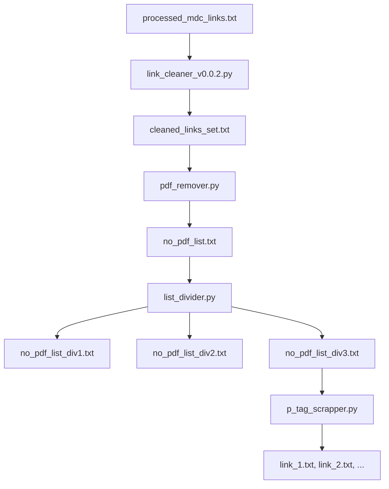

# 🧩 Data Curation – MDC Web Scraping Project

## 📘 Overview
This repository contains the **data curation and web scraping pipeline** for Miami Dade College’s website.  
The goal is to **collect, clean, and structure** website data for further use by downstream teams (e.g., NLP, analytics, or AI assistants).

The process begins with a raw list of MDC URLs (`processed_mdc_links.txt`) and ends with curated paragraph text files extracted from each page.

---

## ⚙️ Pipeline Summary

```
processed_mdc_links.txt
   │  (raw URLs with #fragments & duplicates)
   ▼
link_cleaner_v0.0.2.py
   │  (removes fragments & duplicates)
   ▼
cleaned_links_set.txt
   │  (deduplicated list of clean URLs)
   ▼
pdf_remover.py
   │  (filters out .pdf links)
   ▼
no_pdf_list.txt
   │  (HTML links only)
   ▼
list_divider.py
   │  (splits into three batches for parallel scraping)
   ▼
no_pdf_list_div1.txt / div2.txt / div3.txt
   │
   └──▶ p_tag_scrapper.py
        (fetches HTML & saves <p> text → link_#.txt)
```

---

## 📂 Repository Contents

| File | Type | Purpose |
|------|------|----------|
| `processed_mdc_links.txt` | Data | Raw list of MDC URLs with duplicates and “#fragment” anchors. |
| `link_cleaner.py` | Script | Removes “#” fragments and duplicates; writes one URL per line (**append mode**). |
| `link_cleaner_v0.0.2.py` | Script | Improved version – writes entire Python list as a single string, compatible with later scripts. |
| `cleaned_links_set.txt` | Data | Cleaned, deduplicated links after running the cleaner. |
| `pdf_remover.py` | Script | Removes all links containing `.pdf` (case-sensitive) and writes results to `no_pdf_list.txt`. |
| `no_pdf_list.txt` | Data | Non-PDF links (still includes `.doc` and other extensions). |
| `list_divider.py` | Script | Splits list into three equal parts of 996 URLs each; saves as `no_pdf_list_div1/2/3.txt`. |
| `no_pdf_list_div1.txt`, `div2.txt`, `div3.txt` | Data | Three batches of links for independent scraping runs. |
| `p_tag_scrapper.py` | Script | Fetches each URL, extracts `<p>` text, and saves one file per page (e.g., `link_1.txt`, `link_2.txt`). |
| `._processed_mdc_links.txt` | System | macOS hidden metadata file (safe to delete). |

---

## 🧠 Script Documentation

### 1. `link_cleaner.py`
Removes “#” fragments and duplicates from the URL list.

- **Functions:**
  - `clean_links(url)` – truncates everything after `#`.
  - `create_list_without_duplicates(lst)` – removes duplicate entries.
  - `append_list_to_file(lst, filename)` – appends URLs line by line (**use with caution**, causes duplicates if re-run).
- **Output:** `cleaned_links_set.txt` (newline-separated URLs).

### 2. `link_cleaner_v0.0.2.py`
Same logic as above, but saves the **entire cleaned list as a Python literal string**.  
This version ensures compatibility with `ast.literal_eval()` used in later scripts.  
✅ **Recommendation:** Always use this version.

---

### 3. `pdf_remover.py`
- **Reads:** `cleaned_links_set.txt`
- **Filters:** removes links containing “`.pdf`” (case-sensitive match).
- **Writes:** `no_pdf_list.txt` as a Python list string.
- **Key variable:** `new_clean` holds non-PDF links.
⚠️ Only removes `.pdf` files — `.doc`, `.xlsm`, etc. remain.

---

### 4. `list_divider.py`
- **Reads:** `no_pdf_list.txt`
- **Splits:** list into 3 files (`no_pdf_list_div1/2/3.txt`) for batch scraping.
- **Logic:** First two divisions contain 996 items each; remaining URLs go to the third file.
- **Improvement suggestion:** Make split size dynamic to avoid hardcoded limits.

---

### 5. `p_tag_scrapper.py`
Fetches and extracts all `<p>` tag text from each URL.

- **Libraries:** `requests`, `BeautifulSoup`.
- **Functions:**
  - `scrape_paragraphs(url)` – downloads the page and extracts text.
  - `write_list_to_file(lst, filename)` – writes paragraphs line-by-line.
  - `generate_filename(base_name, ext, index)` – ensures unique output filenames.
- **Bug:**  
  Line `index =+ 1` should be `index += 1` — otherwise, index resets on each loop iteration.
- **Output:** `link_#.txt` text files for each scraped page.

---

## 🧩 Data Flow Diagram



---

## 🧰 Dependencies

Install required Python libraries:

```bash
pip install requests beautifulsoup4
```

---

## 🚀 Running the Pipeline

```bash
# 1. Clean URLs
python legacy_link_cleaner_v0.0.2.py

# 2. Remove PDFs
python legacy_pdf_remover.py

# 3. Divide into smaller lists
python legacy_list_divider.py

# 4. Scrape paragraph text
python legacy_p_tag_scrapper.py
```

---

## 🧾 Output Format Proposal (for future stages)

For better integration with downstream AI or NLP processing, store output as **JSONL**:

```json
{
  "url": "https://www.mdc.edu/example/",
  "fetched_at": "2025-11-04T14:00:00Z",
  "status": 200,
  "paragraphs": ["First paragraph", "Second paragraph", "..."],
  "batch": "div3"
}
```

---

## 🧩 Recommended Improvements
- ✅ Replace `ast.literal_eval` and plain text lists with **JSON** files.
- ✅ Change `'a'` (append) to `'w'` (write) to prevent duplication.
- ✅ Add request **timeouts, retries, and headers** to the scraper.
- ✅ Include an **error log** for failed URLs.
- ✅ Automate cleanup (temporary folders, timestamped runs).

---
